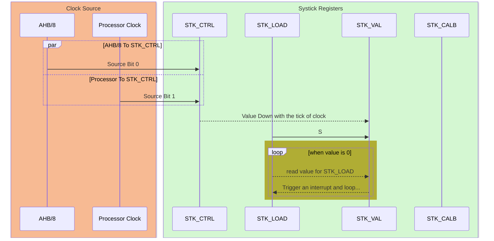

### CM3-SysTick
---
#### 1.SysTick Illustrate
Cortex M3 has a 24-bits system timer, which is bond to **NVIC**,(error code:15).The source clock is programmable, so you can choose wether the AHB/8 or processor clock by setting the value of bit2 in **STK_CTRL**(systick control and status register), and the msb in **STK_CTRL** is the enable bit. 




#### 2.STM32 System Tick Usage
We can see the systick register struct and config function  in **core_cm3.h** header file. It's easy to see what does the function do.

```C:
typedef struct
{
  __IO uint32_t CTRL;                         /*!< Offset: 0x00  SysTick Control and Status Register */
  __IO uint32_t LOAD;                         /*!< Offset: 0x04  SysTick Reload Value Register       */
  __IO uint32_t VAL;                          /*!< Offset: 0x08  SysTick Current Value Register      */
  __I  uint32_t CALIB;                        /*!< Offset: 0x0C  SysTick Calibration Register        */
} SysTick_Type;
```
Below is the config function for systick, the parameter tick is the value for reload register, so basically you can set the period of systick interrupt by calling this function. And within the function priority of systick interrupt can be programmable, so you can change the priority of systick by changing the value event though it's an internal interrupt.

```C:
    static __INLINE uint32_t SysTick_Config(uint32_t ticks)
    { 
    if (ticks > SysTick_LOAD_RELOAD_Msk)  return (1);            /* Reload value impossible */
                                                                
    SysTick->LOAD  = (ticks & SysTick_LOAD_RELOAD_Msk) - 1;      /* set reload register */
    NVIC_SetPriority (SysTick_IRQn, (1<<__NVIC_PRIO_BITS) - 1);  /* set Priority for Cortex-M0 System Interrupts */
    SysTick->VAL   = 0;                                          /* Load the SysTick Counter Value */
    SysTick->CTRL  = SysTick_CTRL_CLKSOURCE_Msk | 
                     SysTick_CTRL_TICKINT_Msk   | 
                     SysTick_CTRL_ENABLE_Msk;                    /* Enable SysTick IRQ and SysTick Timer */
    return (0);                                                  /* Function successful */
    }
```